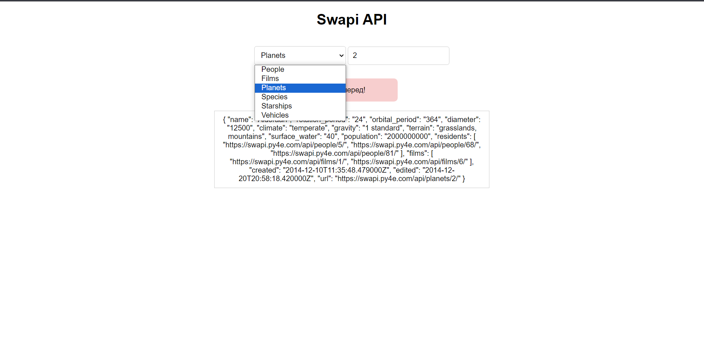

# Swapi API

Приложение, которое делает запрос к API - Swapi и полученную информацию показывает на экране. Swapi — это доступный источник данных для всех данных из канонической вселенной «Звездных войн». Можно запросить данные о персонажах, кораблях и не только!

В запросе передаем, какую сущность хотим получить (фильмы, людей, планет starships) и её числовой идентификатор. В API есть по 10 сущностей каждого вида, поэтому идентификатор от 1 до 10:

Запрос уходит на сервер при нажатии на кнопку. В разметке HTML два поля: в первом - результат поиска, если данные пришли и всё хорошо, во втором — ошибка, если что-то пошло не так. Сообщения видны поочередно. Если результат показан, ошибка сброшена. И наоборот.

Добавлен обработчик ответа: если ответ успешный, следующий обработчик then получает объект ответа на вход, если с ответом что-то не так, промис отклонен. Использованы блоки catch и finally.

Интерфейс сообщает пользователю, что идёт загрузка надписью «Loading» пока идёт запрос.

<a href="https://swapi.py4e.com/documentation">Документация</a> открытого API — Swapi.

Технологии:

  
 
   
  
  

